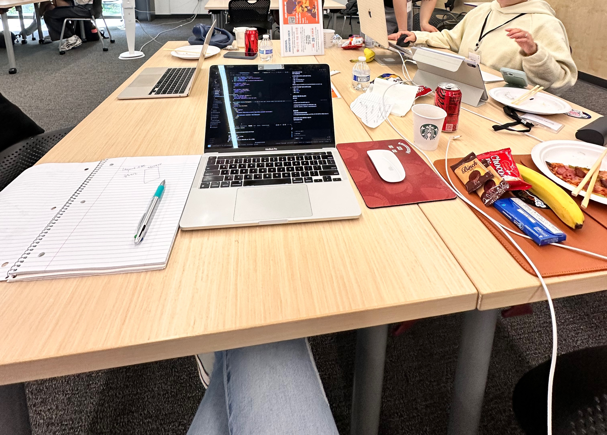
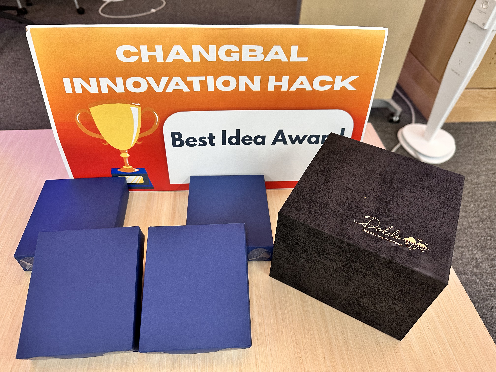
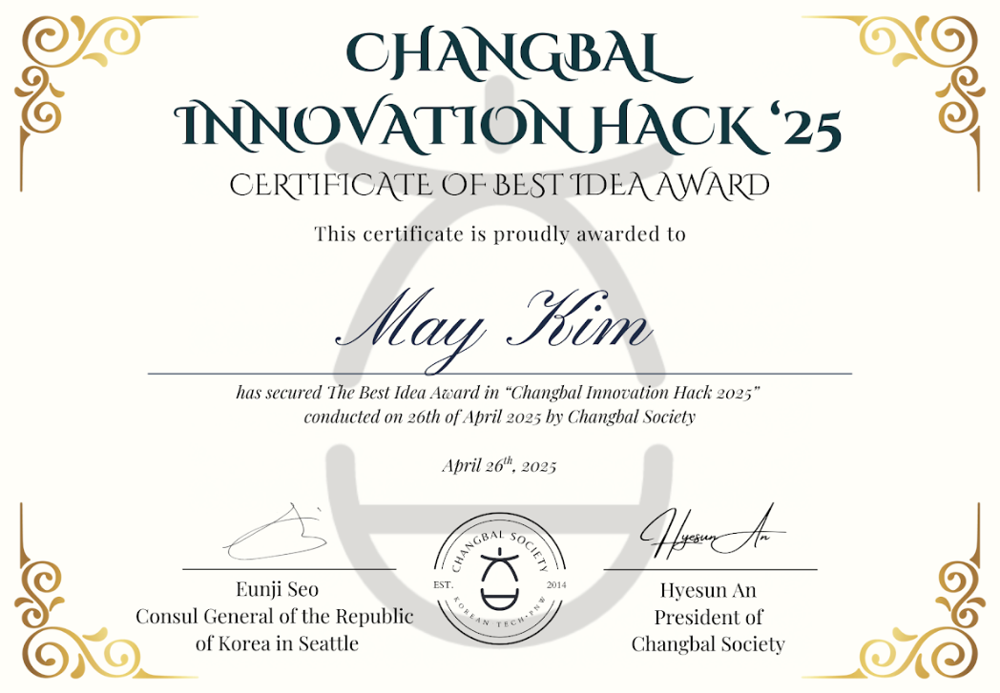
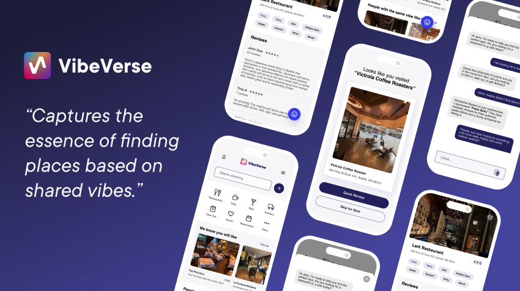
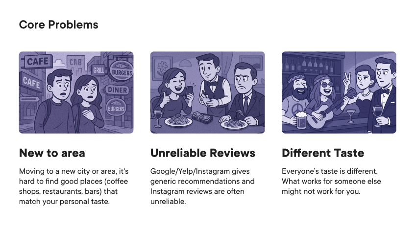
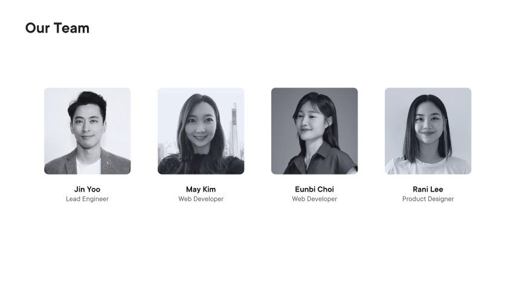
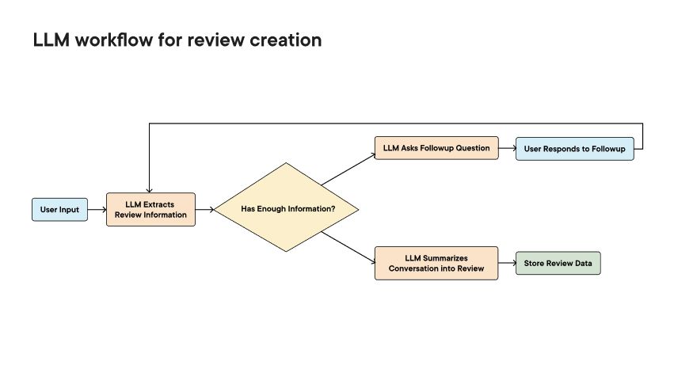
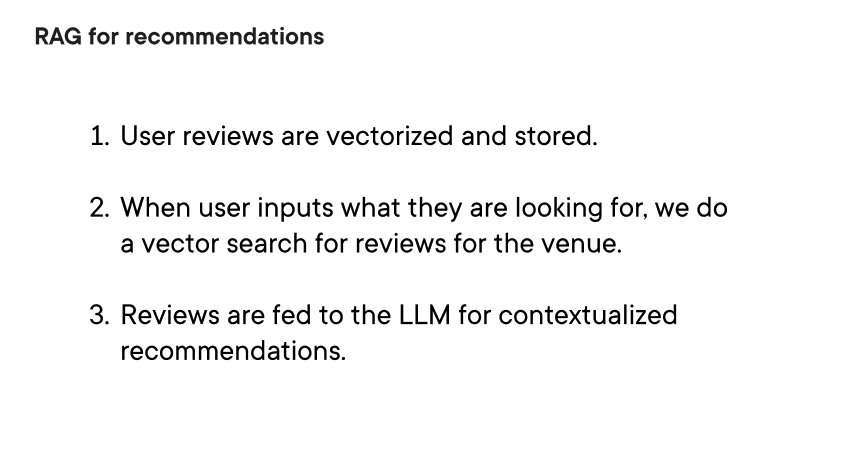

🏆 **Awarded the Consulate General of the Republic of Korea in Seattle Prize at Changbal Hackathon on April 26, 2025**

🔗 **View all our repositories here**: [VibeVerse GitHub Organization](https://github.com/orgs/team1CB04262025/repositories)

# Personalized Review and Recommendation System Powered by LLMs





## Overview






Built within 12 hours by a team of 1 UX designer and 3 software engineers, this project leverages Large Language Models (LLMs) to:

- Analyze user preferences
- Generate personalized, human-like reviews
- Recommend second-stage places or items based on the evolving taste profile

---

## Tech Stack

- **Framework**: Next.js (App Router)
- **Language**: TypeScript
- **State Management**: React built-in state
- **Styling**: Tailwind CSS
- **Backend/API**: OpenAI API integration (via AI SDK)
- **AI Integration**: AI SDK (OpenAI, Google)
- **Database**: Local mock database
- **Search Engine**: Orama (local vector search, data persistence plugin)
- **Schema Validation**: Zod
- **Animations**: Framer Motion
- **Icon Library**: Lucide React, React Icons
- **Database Seeding**: ts-node (TypeScript seed scripts)
- **Config Tools**: ESLint, PostCSS, pnpm

---

## Folder Structure

```
src/
 ├── app/
 │    ├── api/                  # Backend API routes (chat, review creation, recommendation creation)
 │    ├── create_review/         # Pages for user review creation
 │    ├── create_recommendation/ # Pages for personalized recommendation creation
 │    ├── reviews/               # Review display pages
 │    ├── landing1/              # First landing page
 │    ├── landing2/              # Second landing page
 │    ├── recommend/             # Recommendation result pages
 │    ├── visit/                 # Visit tracking pages
 │    ├── layout.tsx             # App layout configuration
 │    └── page.tsx               # Main entry page
 ├── components/                 # Reusable UI components (ChatBox, Layouts, etc.)
 ├── db/                         # Local database using Orama (mock data: places, reviews)
 ├── lib/llm/                    # LLM integration (prompt templates, review agents)
public/
 └── assets/                     # Static files and images

```

---

## Project Highlights

- ✨ **LLM-Based Preference Analysis**: Understand user taste from minimal input
- 📝 **Personalized Review Generation**: Auto-generate rich, natural-sounding reviews
- 🎯 **Second-Stage Recommendation**: Suggest next steps matching refined preferences
- ⚡ **Rapid Prototyping**: Completed a fully functional MVP within 12 hours

---

## System Flow

```plaintext
[User Input (Keywords / Preferences)]
        ↓
[LLM analyzes and generates personalized review]
        ↓
[Preference Profile Updates]
        ↓
[Second-stage Recommendations Based on Profile]
```

---

## Demo

In this demo, the user writes a personalized restaurant review.  
If the review contains enough information, the system immediately provides a second-stage recommendation based on the user's preferences.  
If the information is insufficient, the system intelligently asks follow-up questions to better understand the user's taste.




